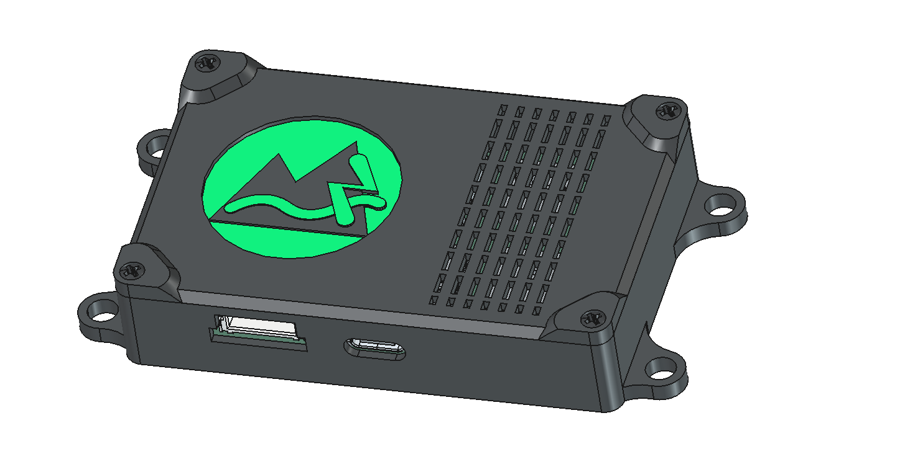

# TrailCurrent Borealis



An ESP32-S3-based environmental sensor node that monitors temperature, humidity, TVOC, and eCO2, broadcasting readings over a CAN bus. Supports over-the-air (OTA) firmware updates, WiFi credential provisioning via CAN, and network discovery for integration with TrailCurrent Headwaters.

## Hardware

- **MCU:** [Waveshare ESP32-S3-Zero](https://www.waveshare.com/product/arduino/boards-kits/esp32-s3/esp32-s3-zero.htm) (4MB flash)
- **Temperature/Humidity:** SHT31-D sensor (I2C)
- **Air Quality:** SGP30 TVOC and eCO2 sensor (I2C)
- **CAN Transceiver:** SN65HVD230DR (3.3V, 500 kbps)
- **Status LED:** Onboard WS2812 RGB LED (GPIO 21)

### Pin Assignments

| Pin | GPIO | Function |
|-----|-------|----------|
| 8 | GPIO5 | I2C SDA (SGP30, SHT31-D) |
| 9 | GPIO6 | I2C SCL (SGP30, SHT31-D) |
| 10 | GPIO7 | CAN TX |
| 11 | GPIO8 | CAN RX |
| - | GPIO21 | Onboard RGB LED |

### Circuit Notes

- KiCad schematic and PCB files are in the `EDA/` directory

## Building

This project uses [ESP-IDF](https://docs.espressif.com/projects/esp-idf/en/stable/esp32s3/get-started/index.html) (v5.x).

```bash
# Configure (first time only)
idf.py set-target esp32s3

# Build
idf.py build

# Flash via USB
idf.py flash

# Monitor serial output
idf.py monitor

# Build, flash, and monitor in one step
idf.py build flash monitor
```

### OTA Upload

```bash
curl -X POST http://<hostname>.local/ota --data-binary @build/borealis.bin
```

## Architecture

The firmware is structured as a multi-file ESP-IDF project:

| File | Purpose |
|------|---------|
| `main/main.c` | Sensor reading loop, TWAI task, LED control |
| `main/sensors.c/h` | I2C drivers for SHT31-D and SGP30 |
| `main/ota.c/h` | NVS WiFi credentials, OTA HTTP server, WiFi config CAN protocol |
| `main/discovery.c/h` | mDNS-based network discovery for Headwaters registration |

### CAN Bus Task

The TWAI (CAN) driver runs in a dedicated FreeRTOS task with alert-based message handling. It uses a dual-state transmission model:

- **TX_ACTIVE** (33ms period): Normal operation when peers are detected on the bus
- **TX_PROBING** (2000ms period): Slow probe when no peers are ACKing, reduces bus noise

The task automatically transitions between states based on TX success/failure and incoming messages. Bus-off recovery is handled via TWAI alerts.

## CAN Bus Protocol

All communication uses a 500 kbps CAN bus. The device transmits sensor data and receives OTA/WiFi/discovery commands.

### Sensor Data (TX)

**CAN ID:** `0x1F` | **DLC:** 8

| Byte | Content |
|------|---------|
| 0 | Temperature (C, rounded integer) |
| 1 | Temperature (F, rounded integer) |
| 2-3 | Humidity (big-endian, value x 100) |
| 4-5 | TVOC in ppb (big-endian) |
| 6-7 | eCO2 in ppm (big-endian) |

Sensor data is transmitted every 33ms (when in TX_ACTIVE mode) with the most recent readings. The SGP30 receives humidity compensation from the SHT31-D for improved accuracy.

### OTA Trigger (RX)

**CAN ID:** `0x00` | **DLC:** 3+

Send the last 3 bytes of the target device's MAC address to trigger OTA mode on that specific device.

| Byte | Content |
|------|---------|
| 0-2 | Target MAC bytes (e.g., `F2 7E 6C` for hostname `esp32-F27E6C`) |

When triggered, the device connects to its configured WiFi network, starts an HTTP server at `/ota`, and waits for a firmware upload for 3 minutes before returning to normal operation.

### WiFi Configuration (RX)

**CAN ID:** `0x01` | **DLC:** varies

WiFi credentials are provisioned over CAN using a chunked protocol. Credentials are stored in NVS (non-volatile storage) and persist across reboots.

| Byte 0 | Message Type |
|--------|-------------|
| `0x01` | Start: contains SSID length, password length, chunk counts |
| `0x02` | SSID chunk: 6-byte payload with chunk index |
| `0x03` | Password chunk: 6-byte payload with chunk index |
| `0x04` | End: contains XOR checksum for validation |

The protocol includes a 5-second timeout — if chunks stop arriving, the state resets.

### Discovery Trigger (RX)

**CAN ID:** `0x02` | **DLC:** any (broadcast)

When received, the device connects to WiFi and advertises itself via mDNS (`_trailcurrent._tcp`) with TXT records:

| Key | Value |
|-----|-------|
| `type` | `borealis` |
| `canid` | `0x1F` |
| `fw` | firmware version |

Headwaters confirms registration by calling `GET /discovery/confirm`. The discovery window is 3 minutes.

## Status LED

The onboard RGB LED indicates the device state:

| Color | State |
|-------|-------|
| Green | Normal operation |
| Blue | OTA update mode (waiting for firmware upload) |

## OTA Updates

1. Provision WiFi credentials via CAN (one-time setup, stored in NVS)
2. Send an OTA trigger message on CAN ID `0x00` with the target device's MAC suffix
3. The LED turns blue and the device connects to WiFi
4. Upload firmware via HTTP: `curl -X POST http://<hostname>.local/ota --data-binary @build/borealis.bin`
5. On success, the device reboots with new firmware
6. On timeout (3 minutes), the device disconnects WiFi and resumes normal operation

The device hostname is printed to serial at boot (format: `esp32-XXYYZZ`).

## Air Quality Levels

### TVOC (Indoor Air Quality)

| Range (ppb) | Rating |
|-------------|--------|
| < 65 | Excellent |
| 65-219 | Good |
| 220-659 | Moderate |
| 660-2199 | Poor |
| >= 2200 | Unhealthy |

### eCO2

| Range (ppm) | Level |
|-------------|-------|
| < 400 | Low (fresh air) |
| 400-999 | Normal |
| 1000-1999 | High |
| >= 2000 | Alarm |

## License

[MIT](LICENSE)
